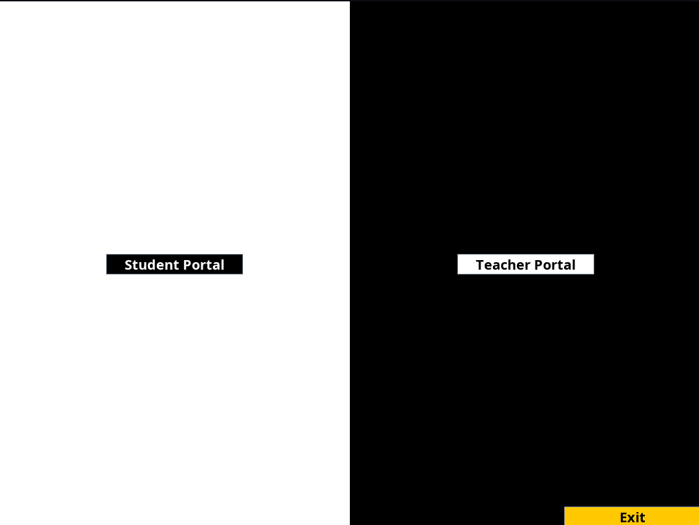
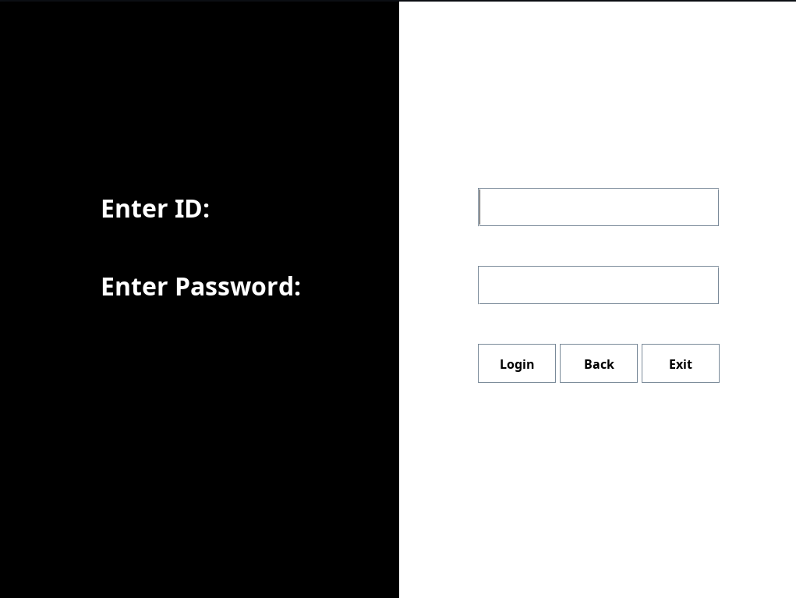
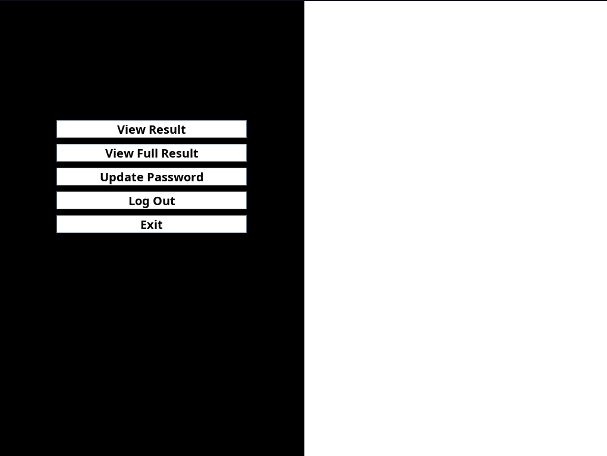
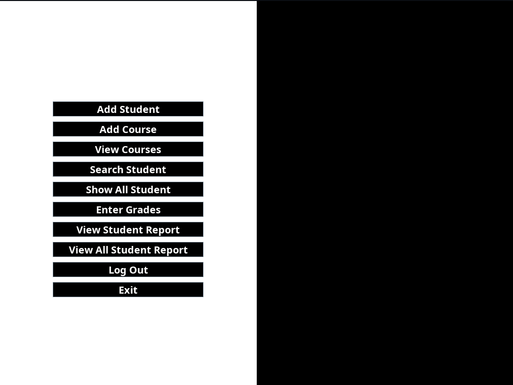
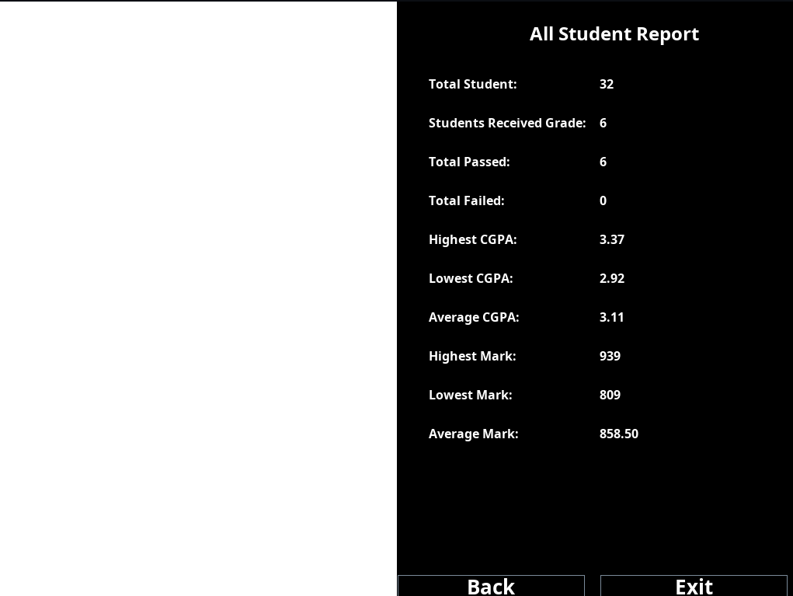
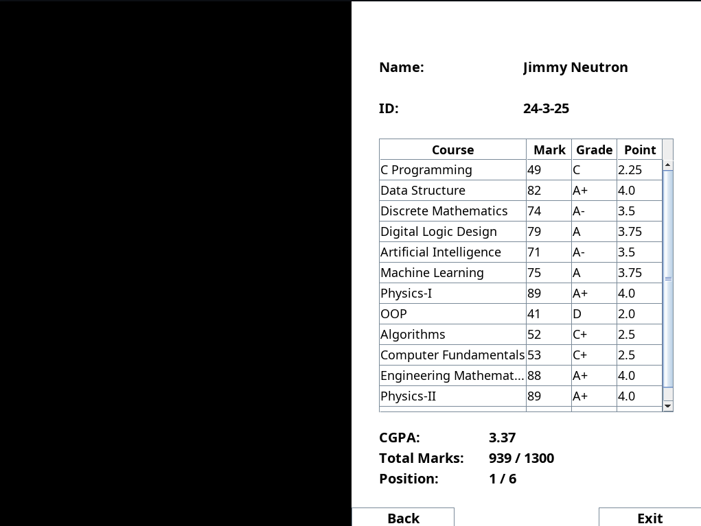

# Student Grade Tracker 🎓📊

**Student Grade Tracker** is a desktop-based student grade management application developed in **Java Swing** using **VSCode**.

The application allows users to manage student information, add courses and grades, calculate CGPA, determine letter grades, and monitor student academic performance through a graphical user interface.

---

## 🎮 Application Overview

**Student Grade Tracker** provides a simple and user-friendly graphical interface for managing student academic records.

The application allows users to:

- Add new students.
- View student information.
- Add courses and marks.
- Calculate CGPA.
- Calculate letter grades.
- View individual student performance.
- View overall class performance.
- Search for students.
- Track highest and lowest marks.
- Rank students based on their CGPA.
- Edit student and course information.
- Manage student grade records through a graphical interface.

---

## 🖥️ Graphical User Interface

The application is built using **Java Swing**, providing a desktop GUI instead of a command-line interface.

The application contains separate interfaces for students and teachers.

### Student Portal

Students can:

- View their courses.
- View their marks.
- View their grades.
- View their CGPA.
- View their complete academic result.

### Teacher Portal

Teachers can:

- Add students.
- Add courses.
- Enter student grades.
- Search for students.
- Edit student information.
- Edit courses.
- View all students.
- View student reports.
- View class rankings.

---

## 👨‍🎓 Student Management

The application allows teachers to add and manage student information through the graphical interface.

Each student can have information such as:

- Student ID
- Student Name
- Courses
- Marks
- Grade Points
- CGPA
- Letter Grade

---

## 📚 Courses & Grade Management

Teachers can add courses and marks for each student using the Java Swing interface.

The application validates the entered information before adding or updating grades.

Each course is assumed to have **3 credits**.

The grade point for each course is determined according to the grading system.

---

## 📊 CGPA Calculation

The application calculates the student's CGPA based on the grade points obtained in different courses.

Since all courses are assumed to have **3 credits**, the CGPA can be calculated by taking the average of the grade points.

```text
CGPA = Total Grade Points / Number of Courses
````

For example:

```text
Course          Marks       Grade Point
---------------------------------------
Java              85           4.00
Database          78           3.75
Mathematics       92           4.00
Algorithms        88           4.00

Total Grade Points = 4.00 + 3.75 + 4.00 + 4.00

Total Grade Points = 15.75

Number of Courses = 4

CGPA = 15.75 / 4

CGPA = 3.94
```

Therefore, the student's CGPA is:

```text
3.94
```

---

## 🏆 Grading System

The application determines the letter grade and grade point based on the marks obtained.

```text
Marks Range       Grade       Grade Point
------------------------------------------
80 - 100            A+            4.00
75 - 79             A             3.75
70 - 74             A-            3.50
65 - 69             B+            3.25
60 - 64             B             3.00
55 - 59             B-            2.75
50 - 54             C+            2.50
45 - 49             C             2.25
40 - 44             D             2.00
Below 40            F             0.00
```

---

## 📈 Student Performance

The application provides detailed information about a student's academic performance.

A student's result includes:

- Student ID
- Student Name
- Course List
- Marks
- Letter Grade
- Grade Point
- CGPA
- Ranking

Example:

```text
Student: John Doe
Student ID: 101

Course          Marks       Grade       Grade Point
----------------------------------------------------
Java              85          A+            4.00
Database          78          A             3.75
Mathematics       92          A+            4.00
Algorithms        88          A+            4.00

----------------------------------------------------

CGPA:             3.94
```

---

## 🔎 Student Search

Teachers can search for a student using the student's ID.

Example:

```text
Student ID: 101

Student Found!

Name:        John Doe
ID:          101
```

If the student does not exist, the application displays an appropriate message.

---

## 📄 Student Report

The application can display a complete academic report for an individual student.

The report contains:

- Student information
- Course information
- Marks
- Letter grades
- Grade points
- CGPA
- Academic ranking

---

## 🖼️ Application Screenshots

### Main Screen



### Login Screen



### Student Portal Screen



### Teacher Portal Screen



### All Student Report Screen



### Student Report Screen



---

## ⚙️ Features

- **Graphical User Interface** built with Java Swing.
- **Student Management** for adding and managing students.
- **Student Search** using student ID.
- **Course Management** for adding and editing courses.
- **Grade Management** for entering and updating marks.
- **Automatic Grade Calculation**.
- **Automatic Grade Point Calculation**.
- **CGPA Calculation**.
- **Student Performance Reports**.
- **All Student Performance Statistics**.
- **Student Ranking** based on CGPA.
- **Highest and Lowest Mark Calculation**.
- **Input Validation**.
- **Interactive Tables** for displaying student and grade information.
- **Student Portal** for viewing academic results.
- **Teacher Portal** for managing students and courses.
- **Login System** for user authentication.
- **Password Update** functionality.
- **Session Management**.
- **Inactivity Detection**.
- **Object-Oriented Design**.
- **Event-driven GUI programming** using Java Swing.
- **File I/O** for saving and loading student records.

---

## 🧱 OOP Concepts Used

The project is designed using Object-Oriented Programming principles.

### Classes and Objects

The application is divided into different classes representing the entities and functionality of the system.

```text
Login
Update_Password
Student_Portal
Teacher_Portal
Edit_Course
Edit_Student
Ranking
View_Student_Report
Load_All_Student_Report
Session_Check
Pair
```

### Composition

A student can have multiple courses and corresponding grades.

```text
Student
   │
   ├── Course
   │     └── Grade
   │
   ├── Course
   │     └── Grade
   │
   ├── Course
   │     └── Grade
   │
   └── Course
         └── Grade
```

### Event-Driven Programming

Since the application uses Java Swing, user actions such as clicking buttons, selecting table rows, and entering data trigger specific events.

```text
User Action
     │
     ▼
Button Click / Input
     │
     ▼
ActionListener
     │
     ▼
Application Logic
     │
     ▼
Data Processing
     │
     ▼
GUI Update
```

### File I/O

The application uses files to store and retrieve student, course, grade, and session information.

```text
Java Application
       │
       ▼
File I/O
       │
       ├── Course List
       ├── Student ID
       ├── Grades
       ├── Mark Sheets
       └── Current Session
```

---

## 💻 Tech Stack

- Language: **Java**
- GUI Framework: **Java Swing**
- IDE: **VSCode**
- Tools: **Git + GitHub**
- Concept: **Object-Oriented Programming**
- Application Type: **Desktop GUI Application**
- Data Storage: **File I/O**
- Build: **Java JDK**

---

## 🚀 How to Run

### 1. Go To The Directory Where You Want To Download The Project

Open the Terminal / PowerShell in the directory where you want to download the project.

### 2. Clone The Repository

```bash
git clone https://github.com/SRSunny023/CodeAlpha_Student-Grade-Tracker.git
```

### 3. Go To The Project Directory

```bash
cd CodeAlpha_Student-Grade-Tracker
```

### 4. Open The Project

Open the project in **VSCode**.

### 5. Make Sure Java/JDK Is Installed

Make sure Java JDK is installed and configured properly.

You can check the Java version using:

```bash
java -version
```

You can also check the Java compiler using:

```bash
javac -version
```

### 6. Locate The Welcome Class

The main entry point of the application is:

```text
src/
└── Welcome.java
```

### 7. Run The Application

Run:

```text
Welcome.java
```

from VSCode.

The Java Swing application window should open automatically.

---

## 📂 Project Structure

```text
CodeAlpha_Student-Grade-Tracker/
│
├── src/
│   │
│   ├── model/
│   │   ├── Student_Portal.java
│   │   └── Teacher_Portal.java
│   │
│   ├── service/
│   │   ├── Edit_Course.java
│   │   ├── Edit_Student.java
│   │   ├── Load_All_Student_Report.java
│   │   ├── Pair.java
│   │   ├── Ranking.java
│   │   ├── Session_Check.java
│   │   └── View_Student_Report.java
│   │
│   ├── ui/
│   │   ├── Main_Menu.java
│   │   └── Splash_Screen.java
│   │
│   ├── teacher/
│   │   ├── Add_Course.java
│   │   ├── Add_Student.java
│   │   ├── Enter_Grades.java
│   │   ├── Search_Student.java
│   │   ├── Show_All_Student.java
│   │   ├── View_All_Course.java
│   │   ├── View_All_Student_Report.java
│   │   └── View_Specific_Student_Report.java
│   │
│   ├── global/
│   │   ├── Global_Functions.java
│   │   ├── Global_Variables.java
│   │   └── Inactivity_Manager.java
│   │
│   ├── auth/
│   │   ├── Login.java
│   │   └── Update_Password.java
│   │
│   └── Welcome.java
│
├── data/
│   │
│   ├── grades/
│   │   └── *.txt
│   │
│   ├── marksheet/
│   │   └── *.txt
│   │
│   ├── Course_List.txt
│   ├── Current_Session.txt
│   └── Student_ID.txt
│
├── resources/
│   │
│   ├── icon/
│   │   └── Welcome.png
│   │
│   └── screenshots/
│       ├── mainScreen.png
│       ├── loginScreen.png
│       ├── studentPortal.png
│       ├── teacherPortal.png
│       ├── allStudentReport.png
│       └── viewFullResult.png
│
├── .gitignore
└── README.md
```

---

## 🔄 Application Flow

```text
                    START APPLICATION
                           │
                           ▼
                     Splash Screen
                           │
                           ▼
                      Login Screen
                           │
             ┌─────────────┴─────────────┐
             │                           │
             ▼                           ▼
        Student Login              Teacher Login
             │                           │
             ▼                           ▼
       Student Portal             Teacher Portal
             │                           │
             │                    ┌──────┼─────────┐
             │                    │      │         │
             │                    ▼      ▼         ▼
             │                 Student  Course   Grade
             │                 Manage   Manage   Manage
             │                    │      │         │
             │                    └──────┼─────────┘
             │                           │
             │                           ▼
             │                    Generate Reports
             │                           │
             └──────────────┬────────────┘
                            │
                            ▼
                       View Results
                            │
                            ▼
                          Logout
```

---

## 📊 CGPA Calculation Example

Suppose a student has completed four courses:

```text
Course          Marks       Grade       Grade Point
----------------------------------------------------
Java              85          A+            4.00
Database          78          A             3.75
Mathematics       92          A+            4.00
Algorithms        88          A+            4.00
```

Total grade points:

```text
4.00 + 3.75 + 4.00 + 4.00 = 15.75
```

Number of courses:

```text
4
```

Therefore:

```text
CGPA = 15.75 / 4

CGPA = 3.94
```

---

## 🔐 Authentication & Session Management

The application includes an authentication system for controlling access to different parts of the application.

The system supports:

- User login.
- Password update.
- Student portal.
- Teacher portal.
- Current session tracking.
- Inactivity detection.
- Logout functionality.

The application automatically manages the current user session and prevents unauthorized access to protected features.

---

## 💾 Data Storage

The application uses **File I/O** instead of a database for storing application data.

Student and course information is stored in text files.

```text
data/
├── grades/
│   └── *.txt
│
├── marksheet/
│   └── *.txt
│
├── Course_List.txt
├── Current_Session.txt
└── Student_ID.txt
```

This allows the application to retain important information between executions.

---

## 🎯 Future Improvements

`1` Add multiple semesters.

`2` Add course credit-hour management.

`3` Add graphical performance charts.

`4` Improve the Java Swing user interface.

`5` Add customizable themes.

`6` Add database support using MySQL.

`7` Export student reports as PDF files.

`8` Add attendance tracking.

`9` Add semester-wise performance tracking.

`10` Add data backup and restore functionality.

`11` Add GPA/CGPA history for each semester.

`12` Add more advanced student ranking and analytics.

---

## 📝 Author

Siamur Rahman Sunny

Daffodil International University

Bangladesh
